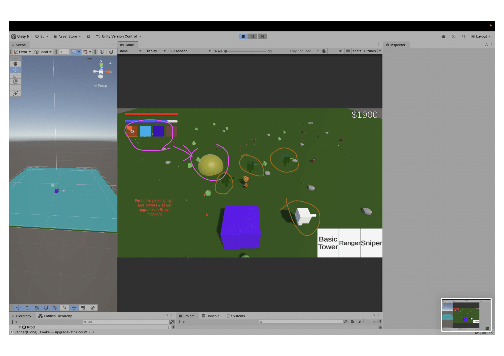
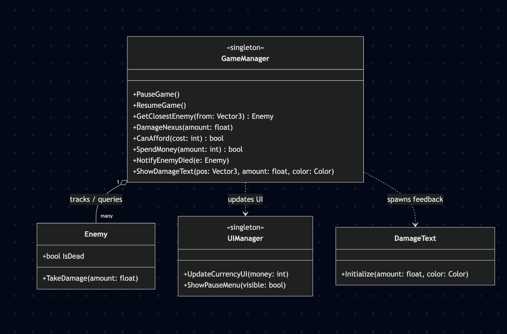
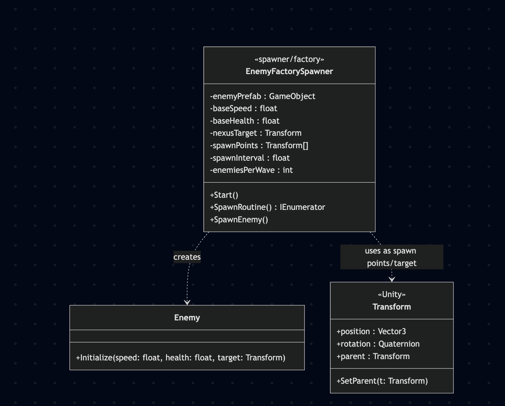
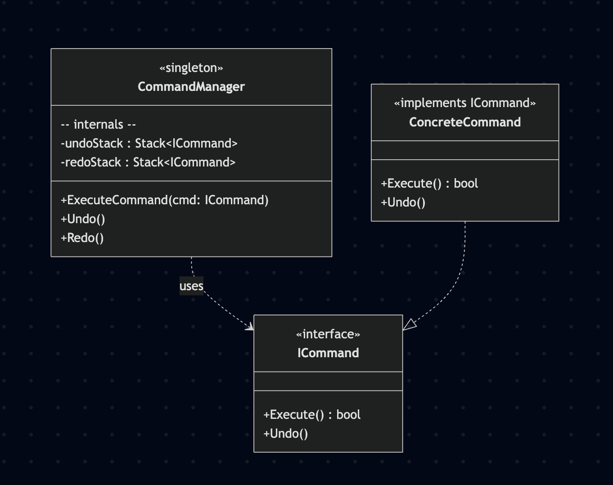
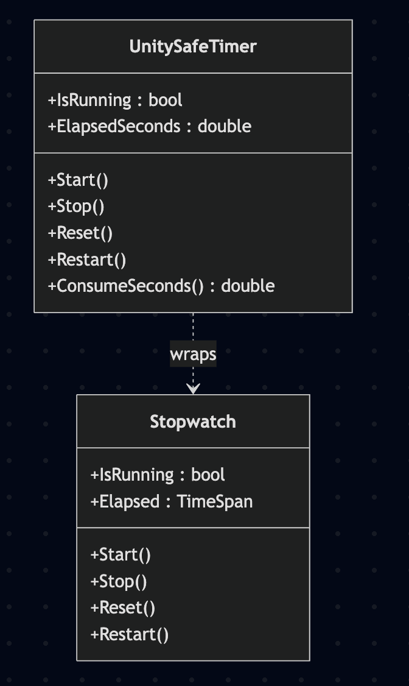

# TD_Project

## Names: Arshiya Shahbazpourtazehaknd 100832558 & Saw Latt 100755966

## Interactive media scenario information:

A Tower Defence Game with a controllable character (WASD) who can cast spells, place towers, sell towers, and remap key bindings for movement. 

The scenario's purpose will is to showcase all the design patterns so far done in class. The scene so far does not follow the player's movement but is more than capable of showcasing all the design patterns we have learned in class. Enemies will make their way to the nexus and the player must right-click to attack or cast spells to destroy the enemies and place towers to defend the objective. Towers can be upgraded and killing enemies gives cash. 

## Post-Midterm-Progress (Final)

### Performance Profiling of Object pooling vs Without Object Pooling

The idea is simple, we instantiate objects via traditional and tedious way that accumulates garbage memory and use Unity's profiling tool to compare with object pooling's performance. In our game, we use object pooling to better our performance of spawning the environment - a random forest at game start. Due to the nature of the game, it is difficult to gauge performance with little objects and projectiles in play, so we exasperated the material being spawned (8000 trees) to grasp performance profiling.

In this profiling, we see 0.7 MB of GC Alloc when using the traditional for-loop and built-in Instantiate function. We first check if object pooling is enabled, which by default is not. 

However, comparing with using the object pooling design pattern, we see a much better performance compared to that of the regular Instantiate method. 

Here, from the start we see an inital GC Alloc of only 2.1 KB on the same 8000 test prefabs to spawn our random forest. We also included a function to clear the forest and pull from the object pool again to create it and we notice...

A GC Alloc of ~0 KB. This is evident when object pooling setting is checked to enabled such that the performance profiling reflects a positive increase in performance.

Click 1 to cast a fireball

## Summarize in 100 words what strategies did you use for creating the group:

Arshiya and Saw have abilities in logic and reasoning from having a Computer science and Math background. However, our weaknesses are apparent in asset creation and animation because this is our first Game Development Course. The goal of our group formation was familiarity with the dynamic of how each other works which caused significant growth in productivity and lack of pressure when things go south; something not forgiving in groups with peers who we don't know. The later half of the semester will be fine tuning our scripts and creating better assets

### ChatGPT: ChatGPT was used mainly for merge conflict resolution. During research period, a demo DOTS flow field to create pathfinding was done which caused significant delay in development because it never made it to production due to complexity and time restraint. 

### Hiccups: Both students indivudally worked in separated scenes where certain mechanics of the game such as spawning a character to test mechanics such as damage from towers, player, spells, etc. This caused some overlap in scripts where we got confused who's script the GameManager and factory were spawning.

## In bullet point format Indicate the roles and responsibilities for each team member:
## **Team Roles and Responsibilities**

### **Arshiya**
- **Singleton Systems**
  - Developed the **GameManager** for core gameplay logic management.  
  - Implementedthe **UI Manager** to handle HUD elements, player feedback.  

- **Factory Pattern**
  - Created the **Environment Spawner** to efficiently instantiate environmental prefabs (e.g., trees, obstacles, or map props).   

- **Command Design Pattern**
  - Implemented **Key Binding Remap** functionality to allow customizable player input configurations.  

- **General Contributions**
  - Managed UI-related Elements for player interactions and game feedback.  
  - Assisted Developing and setting up the Core Gameplay Features(abilities, Towers and Upgardes).
  - Set up the UI Elements onto the scene. 

---

### **Saw**
- **Singleton Systems**
  - Co-developed the **GameManager**, focusing on gameplay state transitions and coordination between systems.  
  - Implemented the **CommandManager** to handle execution of player-issued commands (builds and Upgrades).  

- **Factory Pattern**
  - Built the **Enemy Factory**, responsible for spawning and configuring different enemy types.  

- **Command Design Pattern**
  - Implemented the **Undo Tower Placement (Sell)** command to enable tower refund mechanics.
    
- **DLL Plugin**
  - Developed the **Timer Countdown** plugin (DLL) for **wave management and timing**.  
  - Integrated the countdown system with the GameManager for wave-based gameplay logic.  
  - Plans for further **wave spawning logic** integration.  

- **General Contributions**
  - Collaborated on **merge conflict resolution** and script organization.  
  - Helped identify and resolve issues from developing in **separate test scenes**.
  - Assisted Developing and setting up the Core Gameplay Features(Enemies, Nexus, Pathing).

  
## Singleton:
Reasoning: A centralized place to handle majority of game logic and help with certain tasks that are considered on-off such as testing and debugging certain features to print into command line. This way, you can avoid have multiple redundant scripts. Creating the Managers as a Signleton allowed us to first of all avoid repeating logic as well as provide a consistent interface for accessing core game and UI mechanics. 
Arshiya: GameManager, UI Manager
Saw: GameManager, CommandManager

## Factory:

Reasoning: rapid iteration and a template of sort that can easily enable devloper to create new types of enemies. This way we also have a method of instantiating environmental prefabs without individually placing them one by one. This Also allows to further than the line use polymorphism to spawn different types of enemies from the same spawner. 

Arshiya: Environment Spawner
Saw: Enemy Factory

## Command Design Pattern:

Reasoning: This Pattern Allowed to wrap our player actions and controlls as command that can be stored, redircted and even scheduled. This allowed us to create a remapping logic for Hero controls and as well implement a sell logic and undo logic that is going to be very handy when restarting the game from the previous wave. 

Arshiya: Key Binding Remap
Saw: Undo Tower placement (sell)

### DLL Plugin

Reasoning: This Pattern can help with managing wave timers, this was a beginner friendly introduction to DLLs so we decided to do not too complicated of a plugin and stuck to a timer.

Saw: Timer countdown for wave management. Countdown timer has been imported, wave logic is still to be developed.

