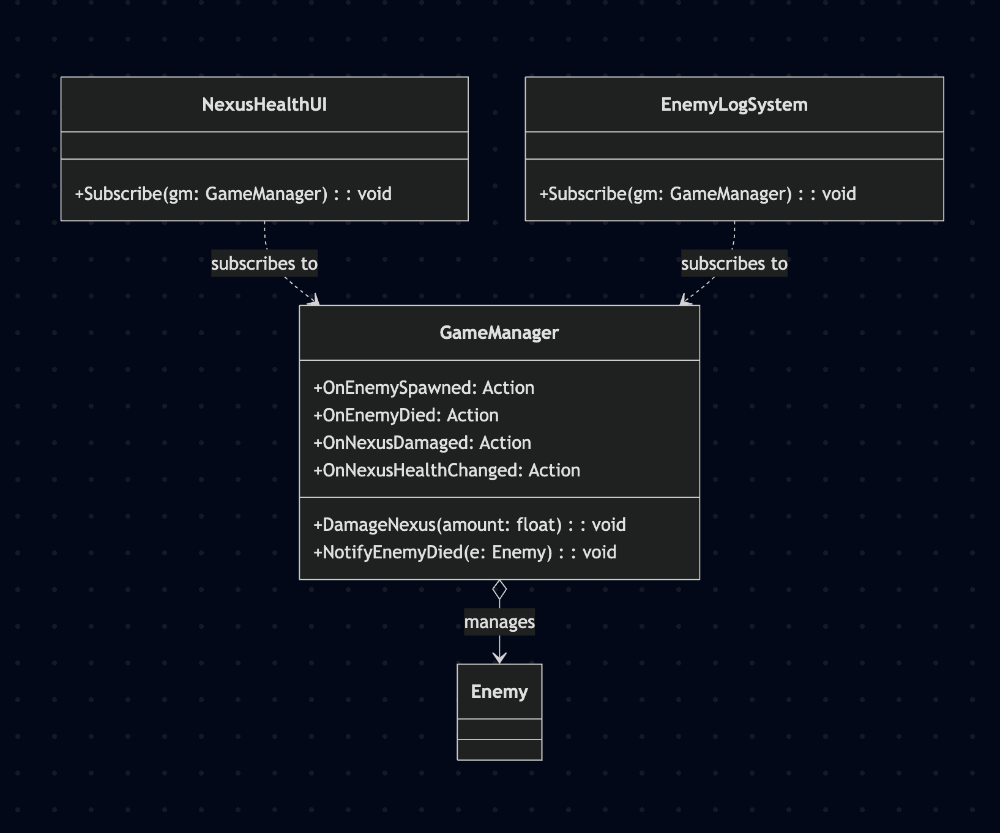
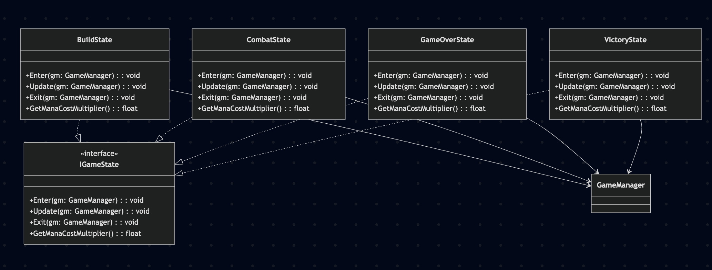
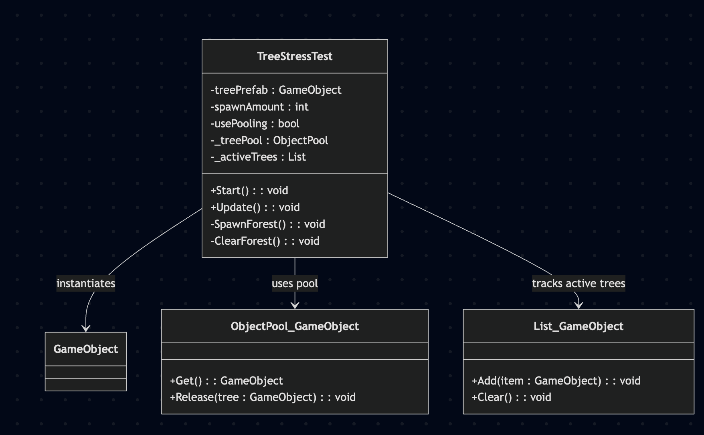

# TD_Project

## Names: Arshiya Shahbazpourtazehaknd 100832558 & Saw Latt 100755966

## Interactive media scenario information:

A Tower Defence Game with a controllable character (WASD) who can cast spells, place towers, sell towers, and remap key bindings for movement. 

The scenario's purpose will is to showcase all the design patterns so far done in class. The scene has improved from last progress report. There is an object pooling method to implement environment as well as performance improvements through object pooling enemies and projectiles. Furthermore, observer and state patterns have been added as required to create a different game states and handling events. QOL changes have been implemented to showcase animations and better fluidity. 

## Post-Midterm-Progress (Final)

### Performance Profiling of Object pooling vs Without Object Pooling

The idea is simple, we instantiate objects via traditional and tedious way that accumulates garbage memory and use Unity's profiling tool to compare with object pooling's performance. In our game, we use object pooling to better our performance of spawning the environment - a random forest at game start. Due to the nature of the game, it is difficult to gauge performance with little objects and projectiles in play, so we exasperated the material being spawned (8000 trees) to grasp performance profiling.

In this profiling, we see 0.7 MB of GC Alloc when using the traditional for-loop and built-in Instantiate function. We first check if object pooling is enabled, which by default is not. 

However, comparing with using the object pooling design pattern, we see a much better performance compared to that of the regular Instantiate method. 

Here, from the start we see an inital GC Alloc of only 2.1 KB on the same 8000 test prefabs to spawn our random forest. We also included a function to clear the forest and pull from the object pool again to create it and we notice...

A GC Alloc of ~0 KB. This is evident when object pooling setting is checked to enabled such that the performance profiling reflects a positive increase in performance.

## Diagrams

### Observer UML

### State UML

### Object Pool UML

### Contributions 

Saw was responsible for the UML designs, Readme Update and performance profiling of object pooling vs non-object pooling perforance. Implementation of 1 object pooling pattern. Arshiya implemented 2 object pooling patterns  (enemies & projectiles), Observer & State pattern and QOL changes. ( Saw 30 - Arshiya 70 split )

