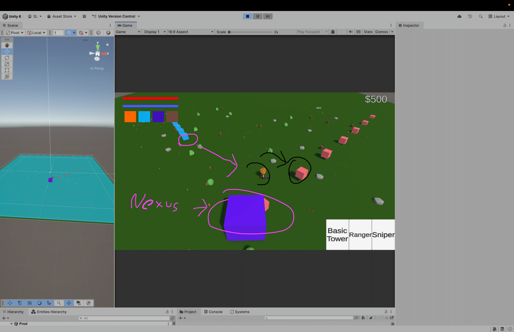

# TD_Project

## Names: Arshiya Shahbazpourtazehaknd 100832558 & Saw Latt 100755966

## Interactive media scenario information:

A Tower Defence Game with a controllable character (WASD) who can cast spells, place towers, sell towers, and remap key bindings for movement. 

The scenario's purpose will is to showcase all the design patterns so far done in class. The scene so far does not follow the player's movement but is more than capable of showcasing all the design patterns we have learned in class. Enemies will make their way to the nexus and the player must right-click to attack or cast spells to destroy the enemies and place towers to defend the objective. Towers can be upgraded and killing enemies gives cash. 

Click 1 to cast a fireball

## Summarize in 100 words what strategies did you use for creating the group:

Arshiya and Saw have abilities in logic and reasoning from having a Computer science and Math background. However, our weaknesses are apparent in asset creation and animation because this is our first Game Development Course. The goal of our group formation was familiarity with the dynamic of how each other works which caused significant growth in productivity and lack of pressure when things go south; something not forgiving in groups with peers who we don't know. The later half of the semester will be fine tuning our scripts and creating better assets

### ChatGPT: ChatGPT was used mainly for merge conflict resolution. During research period, a demo DOTS flow field to create pathfinding was done which caused significant delay in development because it never made it to production due to complexity and time restraint. 

### Hiccups: Both students indivudally worked in separated scenes where certain mechanics of the game such as spawning a character to test mechanics such as damage from towers, player, spells, etc. This caused some overlap in scripts where we got confused who's script the GameManager and factory were spawning.

## In bullet point format Indicate the roles and responsibilities for each team member:

### Singleton:

Reasoning: A centralized place to handle majority of game logic and help with certain tasks that are considered on-off such as testing and debugging certain features to print into command line. This way, you can avoid have multiple redundant scripts.
Arshiya: GameManager, UI Manager
Saw: GameManager, CommandManager

### Factory:

Reasoning: rapid iteration and a template of sort that can easily enable devloper to create new types of enemies. This way we also have a method of instantiating environmental prefabs without individually placing them one by one.

Arshiya: Environment Spawner
Saw: Enemy Factory

### Command Design Pattern:

Reasoning: This Pattern can help implement undo function if you misplace a tower on accident and fully refund the tower or building cost.

Arshiya: Key Binding Remap
Saw: Undo Tower placement (sell)

### DLL Plugin

Reasoning: This Pattern can help with managing wave timers, this was a beginner friendly introduction to DLLs so we decided to do not too complicated of a plugin and stuck to a timer.

Saw: Timer countdown for wave management. Countdown timer has been imported, wave logic is still to be developed.
